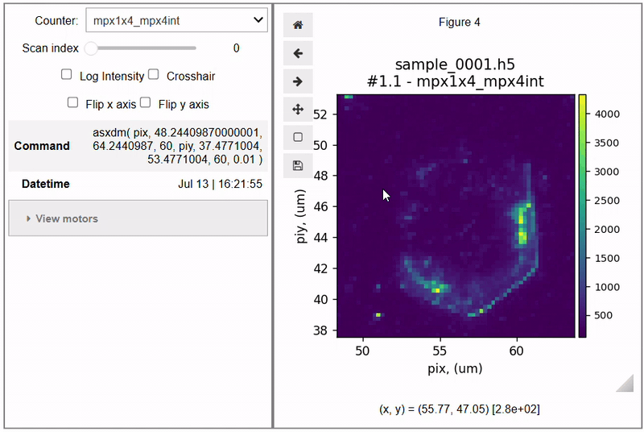
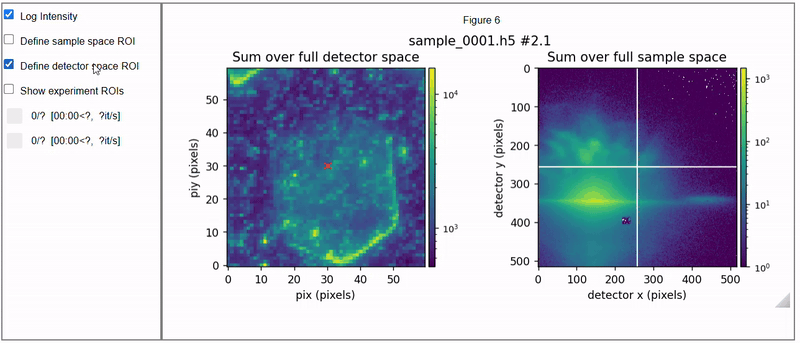

# ID01-SXDM

%apidocs/index

```{toctree}
:caption: Getting started
:maxdepth: 1
:hidden:

install.md
```


```{toctree}
:caption: User Guide
:maxdepth: 1
:hidden:

apidocs/index
```

```{toctree}
:caption: Tutorials
:hidden:

examples/4D-SXDM_tutorial-BLISS.ipynb
examples/5D-SXDM_tutorial-BLISS.ipynb
```

[](https://gitlab.esrf.fr/id01-science/id01-sxdm-utils/-/commits/main) [](https://doi.org/10.5281/zenodo.10777666)

ID01-SXDM is a python package to analyse [scanning X-ray diffraction microscopy][sxdm] (SXDM) data collected on [beamline ID01][id01] at the [European Synchrotron Radiation Facility][esrf] (ESRF). The package has limited capabilities to treat SXDM data from other beamlines too.

[esrf]: https://www.esrf.fr/home.html
[id01]: https://www.esrf.fr/UsersAndScience/Experiments/XNP/ID01
[sxdm]: https://journals.aps.org/prapplied/abstract/10.1103/PhysRevApplied.18.064015

## What is SXDM?

An SXDM experiment consists in scanning a nano-focused X-ray beam across a crystal using a piezoelectric stage. The crystal is rotated so that it fulfils a Bragg condition, and at each position of the nano-focused beam a nano-diffraction pattern is produced. This pattern is recorded on a 2D detector.

### Definitions

**4D-SXDM**: two piezo motors of choice are raster scanned across a chosen area. At each point of the raster, a detector frame is recorded with a chosen exposure time. A 4D dataset results: `Intensity(motor_1, motor_2, detector_x, detector_y)`.

**5D-SXDM**: a set of 4D-SXDM scans taken at varying values of an additional motor, typically the incidence angle. A 5D dataset results: `Intensity(motor_1, motor_2, detector_x, detector_y, extra_motor)`. If the extra_motor is the incidence angle, the 5D dataset corresponds to a rocking curve (3D reciprocal space map) being taken at each point of the raster scan.

## Example functionality

Quickly inspect the results of SXDM scans contained in a given [BLISS][bliss] dataset, also live on the beamline:

```python
%matplotlib widget

import sxdm

path_expt = "./examples/data/MA1234/id01/20230710"
path_dset = f"{path_expt}/sample/sample_0001/sample_0001.h5"

viz = sxdm.widgets.bliss.InspectSXDMCounter(path_dset)
viz.show()
```

Retrieve the sum over the full direct or reciprocal space of a specific scan, using parallel processing for improved speed:

```python
import sxdm

path_expt = "./examples/data/MA1234/id01/20230710"
path_dset = f"{path_expt}/sample/sample_0001/sample_0001.h5"
scan_no = '2.1'

# sum over direct space
frame_sum = sxdm.io.bliss.get_sxdm_frame_sum(path_dset, scan_no)

# sum over reciprocal space
map_shape = sxdm.io.bliss.get_scan_shape(path_dset, scan_no)

pos_sum = sxdm.io.bliss.get_sxdm_pos_sum(path_dset, scan_no)
pos_sum = pos_sum.reshape(map_shape)
```

Explore a 4D-SXDM scan interactively:

```python
%matplotlib widget

import sxdm

path_expt = "./examples/data/MA1234/id01/20230710"
path_dset = f"{path_expt}/sample/sample_0001/sample_0001.h5"

viz = sxdm.widgets.bliss.Inspect4DSXDM(path_dset, scan_no='2.1')
viz.fig.subplots_adjust(left=0.08, right=0.94, wspace=0.4, bottom=0.15)
viz.show()
```


## Widget gallery

The library provides several Jupyter widgets built on top of [ipywidgets](https://ipywidgets.readthedocs.io/en/stable/) to explore SXDM data, both raw and processed via ID01-SXDM.

```{list-table}

* - [InspectSXDMCounter][counter] -
    Navigate through SXDM scans within a dataset.
    * Inspect recorded [BLISS][bliss] counters
    * Display scan parameters (BLISS positioners)
  - 

* - [Inspect4DSXDM][4DSXDM] -
    Explore the four-dimensional space of a 4D-SXDM scan.
    * Integrate portions of 4D space, either direct or reciprocal
    * Visualise individual diffraction patters taken at selected sample coordinates
  - 

* - [Inspect5DQspace][5DSXDM] -
    Visualise the local 3D reciprocal space maps (3D-RSMs) resulting from processed 5D-SXDM data.
    * Overlay computed centres of mass or fitted Gaussian centres on 3D-RSM projections
  - 
```

> Data shown in the widgets above is taken from [this published work](https://onlinelibrary.wiley.com/doi/full/10.1002/pssr.202400241).


% 5D taken from /zatterin/notebooks/beamtimes_links/industry/in1141_Barbier_analysis/analysis/ech_1/combined/nbs_v2/spherical/_006_cartesian.ipynb

[bliss]: https://bliss.gitlab-pages.esrf.fr/bliss/master/
[counter]: \apidocs\sxdm\sxdm.widgets.bliss.InspectSXDMCounter.md
[4DSXDM]: \apidocs\sxdm\sxdm.widgets.bliss.Inspect4DSXDM.md
[5DSXDM]: \apidocs\sxdm\sxdm.widgets.xsocs.md\#API

## Installing

See [install](install.md) for instructions on how to use ID01-SXDM over Jupyter-SLURM.
On a local machine ID01-SXDM can be installed via `pip`:

```bash
pip install git+https://gitlab.esrf.fr/id01-science/id01-sxdm-utils.git
```

## Citing ID01-SXDM

To cite the version published to Zenodo:

```bibtex
@software{sxdm_code,
  author    = {Zatterin, Edoardo},
  title     = {id01-sxdm},
  year      = 2024,
  publisher = {Zenodo},
  doi       = {10.5281/zenodo.10777666},
  url       = {https://doi.org/10.5281/zenodo.10777666}
}
```

## Publications using ID01-SXDM

```{include} publist.md
